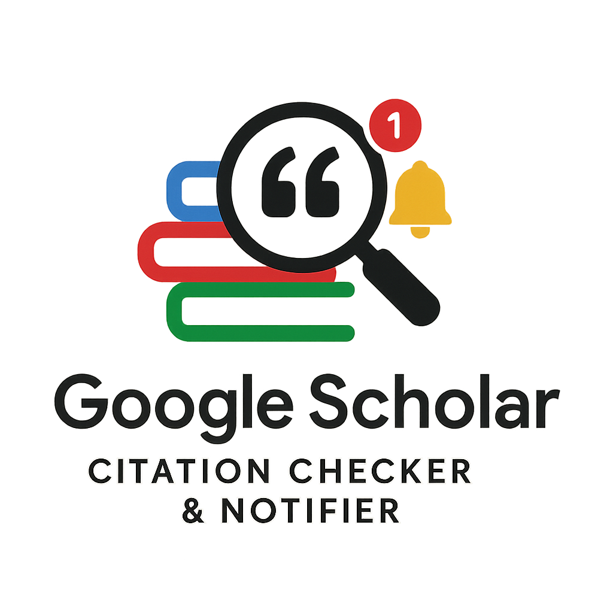

# Google Scholar Citation Checker & Notifier

This Python script automatically checks the total citation count of a specified author on Google Scholar every hour and sends an email notification only when the citation count has increased since the last check.

## Features

*   Fetches total citation counts from Google Scholar using the `scholarly` library.
*   Searches for authors by name or (preferably) by their unique Google Scholar Profile ID.
*   Stores the last known citation count locally to track changes.
*   Sends email notifications via SMTP only when the citation count increases.
*   Configurable via environment variables (using a `.env` file).
*   Runs continuously, checking every hour.
*   Includes logging for monitoring and troubleshooting.

## Setup

1.  **Clone the repository (optional):**
    ```bash
    git clone <your-repository-url>
    cd <repository-directory>
    ```

2.  **Create a `.env` file:**
    Create a file named `.env` in the same directory as the script and add your configuration details. Use the `.env.example` file (or the template below) as a guide:

    ```dotenv
    # --- Google Scholar Author ---
    # Choose *one* of the following options:

    # Option 1: Use Author Name (less reliable, might pick the wrong author if ambiguous)
    # Comment out or remove AUTHOR_ID if using this.
    # AUTHOR_NAME="Albert Einstein" 

    # Option 2: Use Google Scholar Profile ID (Recommended)
    # Find the ID in the profile URL (e.g., https://scholar.google.com/citations?user=YourIDHere&hl=en -> YourIDHere)
    # Comment out or remove AUTHOR_NAME if using this.
    AUTHOR_ID="YourScholarIDHere" 

    # --- Email Settings ---
    # Replace with your SMTP server details and credentials
    SMTP_SERVER="smtp.gmail.com" 
    SMTP_PORT=587 # Use 587 for TLS (recommended) or 465 for SSL
    SENDER_EMAIL="your_sender_email@example.com"

    # IMPORTANT: For Gmail/Google Workspace, if 2-Factor Authentication (2FA) is enabled, 
    # you *must* create and use an "App Password". 
    # See: https://support.google.com/accounts/answer/185833
    SENDER_PASSWORD="your_sender_email_password_or_app_password" 

    # Email address to send notifications to
    RECEIVER_EMAIL="your_recipient_email@example.com" 
    ```
    *   **Fill in the correct values** for your author and email account.
    *   Remember to use an App Password for `SENDER_PASSWORD` if using Gmail with 2FA.

3.  **Install Dependencies:**
    Make sure you have Python 3 and pip installed. Then, install the required libraries:
    ```bash
    pip install -r requirements.txt
    ```

## Usage

1.  **Directly:**
    You can run the script directly from your terminal. It will start checking immediately and continue running, checking every hour.
    ```bash
    python scholar_cite_checker.py
    ```
    You will see log messages printed to the console. Press `Ctrl+C` to stop the script.

2.  **On a Server (Background):**
    To run the script continuously on a server, even after you disconnect, use a tool like `nohup`, `screen`, or `tmux`.

    *   **Using `nohup`:**
        ```bash
        nohup python scholar_cite_checker.py > scholar_checker.log 2>&1 &
        ```
        This runs the script in the background, redirects output to `scholar_checker.log`, and keeps it running after you log out. Check the `scholar_checker.log` file for output.

    *   **Using `screen` or `tmux`:**
        -   Start a new session: `screen` or `tmux`
        -   Run the script: `python scholar_cite_checker.py`
        -   Detach from the session (usually `Ctrl+A` then `D` for `screen`, or `Ctrl+B` then `D` for `tmux`).
        -   You can reattach later using `screen -r` or `tmux attach`.

## Notes

*   **Google Scholar Blocking:** Google Scholar may temporarily block requests if it detects automated scraping. The `scholarly` library attempts to mitigate this, but frequent checks (like every hour) increase the risk. If you encounter issues, consider increasing the check interval (modify `time.sleep(3600)` in the script) or investigate using proxies with `scholarly` (see commented-out code in `get_citation_count`).
*   **Error Handling:** The script includes basic error handling for network issues, email sending problems, and fetching errors. Check the log output (`scholar_checker.log` if using `nohup`, or console output otherwise) if you suspect problems.
*   **First Run:** On the very first run, the script will likely detect the current citation count as an "increase" (from 0) and send an initial email before saving the count. Subsequent emails will only be sent upon actual increases. 